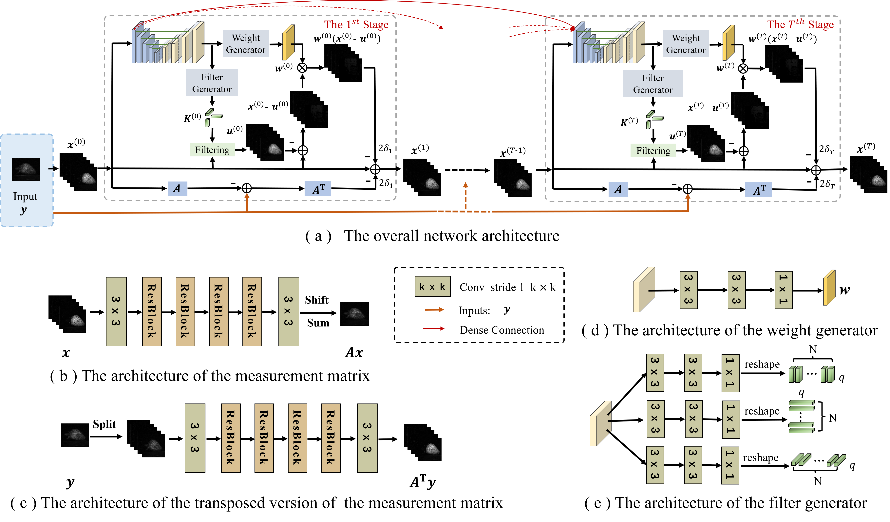

# Deep GSM prior for CASSI
This repository contains the codes for paper **Deep Gaussian Scale Mixture Prior for Spectral Compressive Imaging** (***CVPR (2021)***) by [Tao Huang](https://github.com/TaoHuang95), [Weisheng Dong](https://see.xidian.edu.cn/faculty/wsdong/), [Xin Yuan](http://www.bell-labs.com/about/researcher-profiles/xyuan/). [[pdf]]()  
 

## Contents
1. [Overviewer](#Overviewer)
2. [Network Architecture](#Network Architecture)
3. [Usage](#Usage)
4. [Acknowledgements](#acknowledgements)
5. [Contact](#Contact)

## Overviewer
We have proposed an interpretable hyperspectral image
reconstruction method for coded aperture snapshot spectral
imaging. Different from existing works, our network is inspired by the Gaussian scale mixture prior. Specifically,
the desired hyperspectral images were characterized by the
GSM models and then the reconstruction problem was formulated as a MAP estimation problem. Instead of using
a manually designed prior, we have proposed to learn the
scale prior of GSM by a DCNN. Furthermore, motivated by the auto-regressive model, the means of the GSM models
have been estimated as a weighted average of the spatialspectral neighboring pixels, and these filter coefficients are
estimated by a DCNN as well aiming to learn sufficient
spatial-spectral correlations of HSIs. Extensive experimental results on both synthetic and real datasets demonstrate
that the proposed method outperforms existing state-of-the-art algorithms.

<p align="center">

</p>
Fig. 1 A single shot measurement captured by [18] and 28 reconstructed spectral channels using our proposed method.

## Network Architecture
<p align="center">

</p>
Fig. 2 Architecture of the proposed network for hyperspectral image reconstruction. The architectures of (a) the overall network, (b)
the measurement matrix, (c) the transposed version of the measurement matrix, (d) the weight generator, and (e) the filter generator.

## Usage
### Download the DGSMP repository
0. Requirements are Python 3 and PyTorch 1.2.0.
1. Download this repository via git
```
git clone https://github.com/TaoHuang95/DGSMP
```
or download the [zip file](https://github.com/TaoHuang95/DGSMP/archive/master.zip) manually.


### Testing 
1. Testing on simulation data   
Run **DGSMP_simulation/test.py** to reconstruct 10 synthetic datasets. The results will be saved in 'DGSMP_simulation/Result/Testing-Result/' in the MatFile format.  
2. Testing on real data   
Run **DGSMP_realdata/test.py** to reconstruct 5 real datasets. The results will be saved in 'DGSMP_realdata/Result/Testing-Result/' in the MatFile format.  

### Training 
1. Training simulation model
    1) Put hyperspectral datasets (Ground truth) and mask into corrsponding path, i.e., 'DGSMP_simulation/Data/Training_truth/'.
    2) Run **DGSMP_simulation/train.py**.
2. Training real data model  
    1) Put hyperspectral datasets (Ground truth) and mask into corrsponding path, i.e., 'DGSMP_realdata/Data/Training_truth/'.  
    2) Run **DGSMP_realdata/train.py**.

## Acknowledgements
We thank the author of TSA-Net ([Ziyi Meng](https://github.com/mengziyi64/TSA-Net)) for providing simulation and real data.

## Contact
Tao Huang, Xidian University, Email: thuang_666@stu.xidian.edu.cn, thuang951223@163.com  
Weisheng Dong, Xidian University, Email: wsdong@mail.xidian.edu.cn
Xin Yuan, Bell Labs, Email: xin_x.yuan@nokia-bell-labs.com
